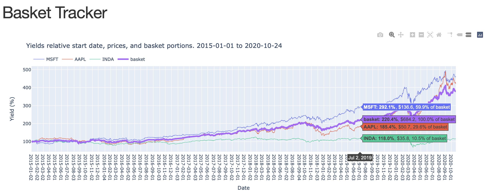

# Stock Basket Tracker

Simple tool that allows you to track the price of a weighted basket of stocks.
Gets stock price data from [Yahoo finance](https://pypi.org/project/yfinance/).



## Setup
- Get [Miniconda](https://docs.conda.io/en/latest/miniconda.html). Then:
```bash
(base) $ git clone https://github.com/samarth-robo/stock_basket_tracker.git
(base) $ cd stock_basket_tracker 
(base) $ conda env create -f environment.yml
(base) $ conda activate stock_basket_tracker
```

# Run the App

The app has a simple interface. Supply a JSON with a dict of ticker names and
weights, and (optionally) start and end dates.

```bash
(stock_basket_tracker) $ python show_history.py --help
usage: show_history.py [-h] -f TICKER_NAMES_FILE [--start_date START_DATE] [--end_date END_DATE]

optional arguments:
  -h, --help            show this help message and exit
  -f TICKER_NAMES_FILE, --ticker_names_file TICKER_NAMES_FILE
  --start_date START_DATE
                        YYYY-MM-DD
  --end_date END_DATE   Default today
```

Run it with an example basket that is included:

```bash
(stock_basket_tracker) $ python show_history.py -f example_basket.json 
Normalizing basket fractions
Getting MSFT data
Getting AAPL data
Getting INDA data
Go to http://localhost:8050
Dash is running on http://127.0.0.1:8050/

 * Serving Flask app "app" (lazy loading)
 * Environment: production
   WARNING: This is a development server. Do not use it in a production deployment.
   Use a production WSGI server instead.
 * Debug mode: off
 * Running on http://127.0.0.1:8050/ (Press CTRL+C to quit)
```

The app will be live at [http://localhost:8050](http://localhost:8050).

# Basket Specification

It is a simple JSON file containing ticker names and fractions or numbers of
shares (the latter will be normalized):

```
{
    "MSFT": 3,
    "AAPL": 4,
    "NVDA": 5,
    "VOO": 0
}
```
You can set the fraction 0 to include a ticker for reference (e.g. `VOO` above).
